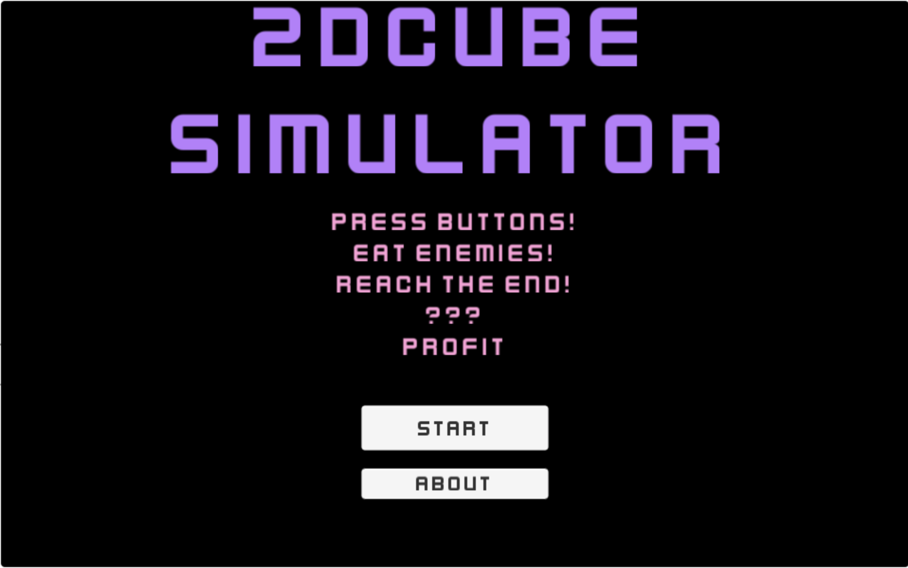
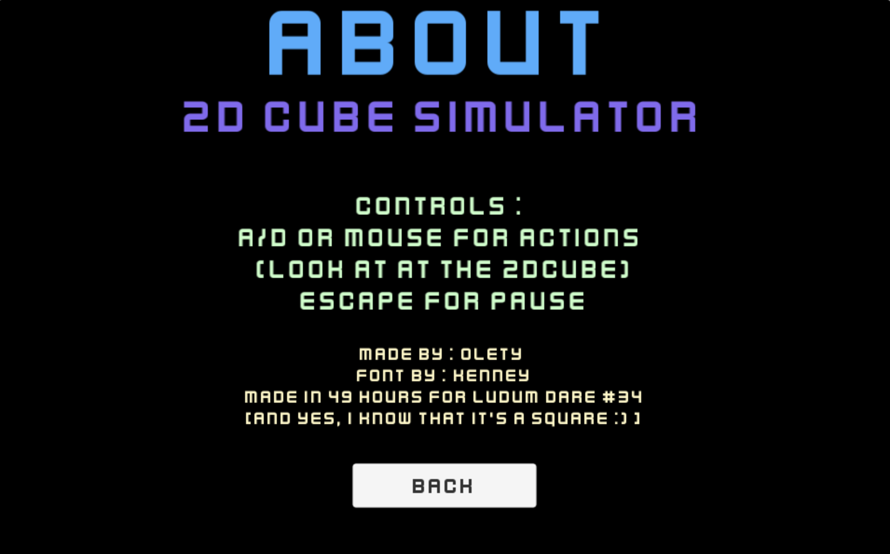
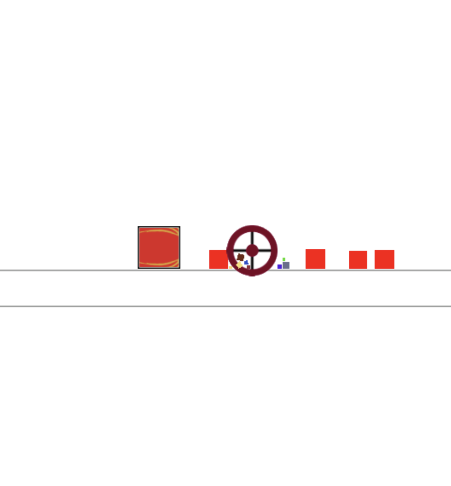
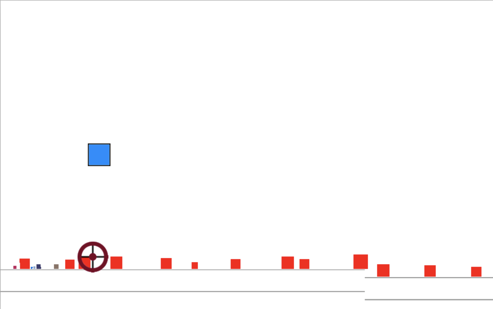

# 2DCubeSimulator - my Ludum Dare #34 entry

Play as a powerful 2DCube, rampaging over puny squares in a quest to get to the golden circle 🟡

You can play the game [here](https://olety.itch.io/square)! Press A or D depending on what is shown on the 2DCube to execute a special move ⚡️

## Theme:
It's a tie this time!
* *Two button controls*
* *Growing*

You can find my ideation process/to-do list in the "Ideas.docx".

## Game screenshots

 
Title screen

 
About page

 
Dash - a special move that propells you forward and makes you invulnerable for a short time

 
Jump - 2DCube jumps up in the air, and then stomps the puny squares reveling below

